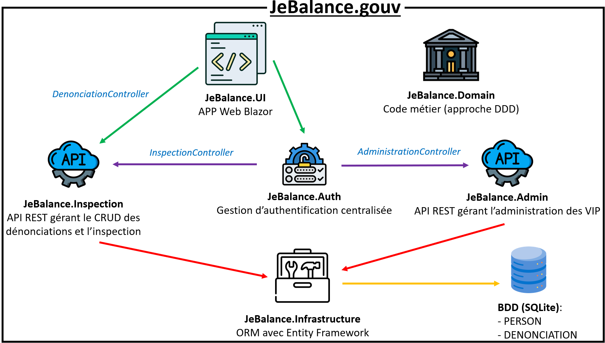

# Rendu de projet - **JeBalance**
## Groupe
- AUMARD Max
- DA SILVA Jeremy
- PASTRES Guillaume

## Démarer le projet
### Setup
 - Importer le projet
  ```
    Disponible sur https://github.com/MaxAumard/JeBalance
  ```
 - Dans le doute update la base de donnée en lancant la dernière migration avec la commande:
 ```
  dotnet ef database update --context DatabaseContext
 ```
 - A partir de l'interface graphique Blazor, on peut accéder à différentes pages, chacunes offrant différentes fonctionnalités:
   - Page Dénonciation (Page d'acceuil) -> permet de créer et récupérer une dénonciation sans s'authentifier
   - Login -> permet à un utilisateur de se connecter et fait apparaître de nouvelles pages selon ses droits d'accès
   - Page Inspection (réservée aux inspecteurs) -> Permet d'afficher les dénonciations non traitées et d'y répondre
   - Page Administration (réservé aux administrateurs) -> Permet d'afficher la liste des VIP et de donner / retirer le statut de VIP 
    
  
   
### Utilisation
- Pour créer une dénonciation, il suffit de remplir le formulaire sur l'onglet Dénoncer
    - les codes postaux doivent être de 0-5 chiffres positifs
    - les champs textuels doivent être entre 3 et 15 charactères (les ";" sont interdits)
- Pour consulter une dénonciation, il suffit de cliquer sur l'onglet Dénonciations et d'entrer l'id de la dénonciation
- Pour répondre à une dénonciation, il suffit sur l'onglet Inspections de choisir une dénonciation non traitée et de remplir le formulaire
- Pour gérer les VIP, il suffit de cliquer sur l'onglet "Gérer les VIP" sur la page Administration

## Infrastructure "JeBalance"
- Domain -> code métier (approche DDD)
- Infrastructure -> ORM pour implémenter les repository du Domain (avec Entity Framework)
  - stockage des données en base de données SQLite
- Inspection -> API REST gérant tout le CRUD des dénonciations, le projet contient 2 controllers:
  - DenonciationController -> Gère la création/ consultation des dénonciaitons sans authentification
  - InspectionController -> Gère les dénonciaiton non traitées, réservée aux Inspecteurs
- Admin -> API REST gérant la gestion des VIPS, réservée aux Administrateurs
- Auth -> Permet de gérer la création des utilisateurs et de leurs droits d'accès
- UI -> couche présentation, Application Web fait avec le framework Blazor


## Respect des consignes
 - [x] Application **C#** en **dotnet 6.0**
 - [x] Architecture **modulaire**
 - [x] Approche **DDD**
 - [ ] Vocabulaire en **français** 
   - non respecté car avoir du code en franglais nous pertubait trop (mais toute interface en français)
 - [x] API **REST**
 - [x] Base **SQLite** accessible avec l'ORM **Entity Framework**
 - [ ] Accès aux API sécurisées avec un **JWT** signé par **HMACSHA256**
   - L'**API Auth** est fonctionnelle et renvoie un token avec les roles associés lors d'une requête de login (admin:admin, inspector:inspector pour les comptes)
   -  **Non implémenté** au niveau des endpoints puisque nous n'avons pas implémenté de système de login dans l'application
 - [x] Les API gérant les administration et l'inpection sont sécurisées et ont un **contrôle d'accès** 
  
## Problèmes rencontrés
### 1. Spécification sur les Response et Adress
  Dù à notre choix de stocker les Adress et les Response dans notre base en un seul string (par concaténation), les spécifications portant sur ces champs ne fonctionnent pas car elles n'arrivent pas à faire la convertion automatiquement avec le visiteur. 
  Nous avons donc dû faire certaines implémentations directement dans l'orm, par exemple "CountDeclinedDenonciations", au lieu passer par la méthde "Count" avec une spécification

### 2. Gestion des logins
 La gestion des comptes utilisateurs n'étant pas demandée, nous avons décidé de ne pas implémenter ce système est de juste créer par défaut un compte Inpecteur et un compte Administrateur, pour les utiliser il suffit d'aller sur la page Login de l'application.
 Pour une évolution future, rajouter un système d'authentification avec login / mot de passe, avec gestion des droits, serait facilement implémentable. Nous avons décidé de ne pas le faire par soucis de temps et le peu de valeur ajoutée par rapport aux consignes.

## Conclusion
Nous avons réussi à implémenter une application fonctionnelle, avec une architecture modulaire et une approche DDD. Nous pensons que nous avons réussi à respecter les consignes, sauf pour l'implémentation de l'authentification qui n'est pas complète. \
Remarque : En temps que groupe de 3 alternants, il était difficile de gérer le temps passé sur le projet après nos journées respectives de travail. Mais nous sommes satisfaits du résultat.


----------
## Annexe
## Données
### Modèles
 Nos modèles d'entités sont identifiables par un guid **opaque** et **non prédictible**

#### Person
  - string Id
  - Name FirstName
  - Name LastName
  - Address Address
  - bool isVip
  - bool isBanned

#### Denonciation
 - string Id
 - string Informant
 - string Suspect
 - DateTimeOffset Date 
 - enum Crime 
 - Response Response

### ValueObject

#### Name
### PostalCode
#### Adresse
 - int RoadNumber
 - Name RoadName ( 3 à 15 charactères, ";" interdit)
 - int PostalCode
 - Name City

#### Response
 - float Retribution
 - enum ResponseType